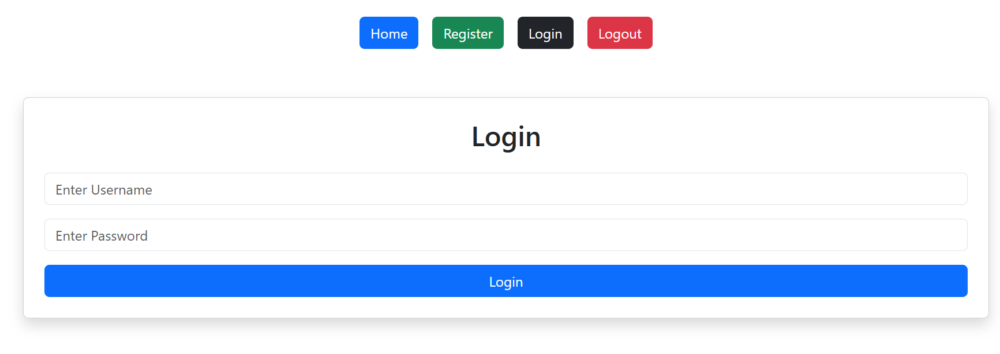
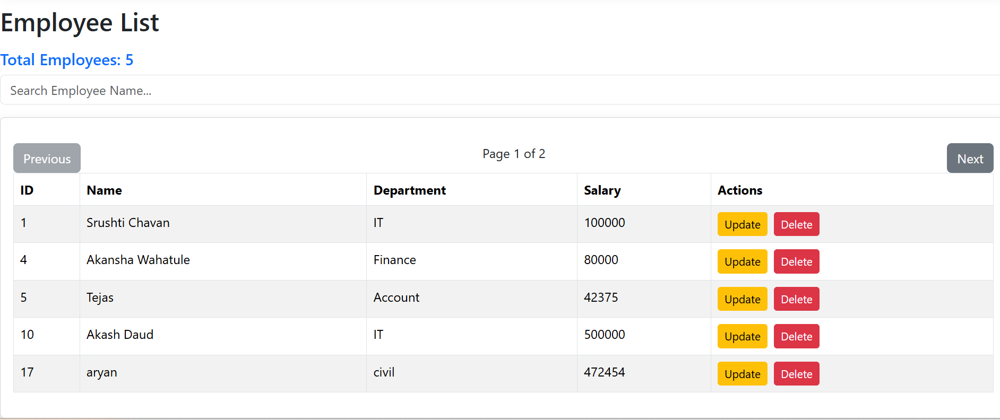
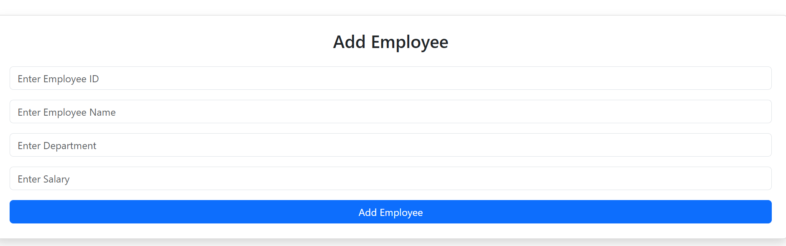
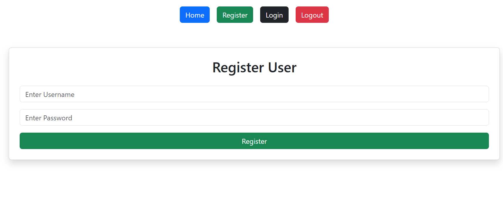
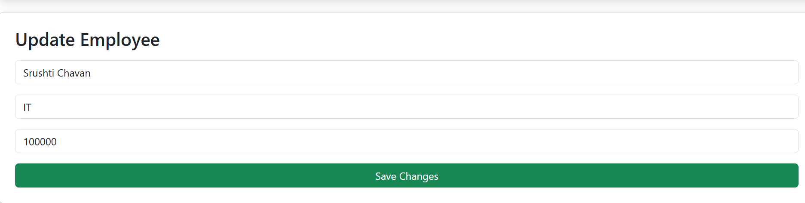

# Employee Management System

- Java 17+
- Node.js 18+
- MySQL 8
- Maven 3+

A Full Stack Employee Management System built with **Spring Boot**, **React**, and **MySQL**. This application allows users to manage employee records efficiently through a clean and responsive user interface.

---

## Features

- User Registration & Login Authentication
- Add New Employee
- View Employee List
- Update Employee Details
- Delete Employee
- Search Employees
- Pagination Support
- Responsive User Interface

---

## Tech Stack

### Backend
- Java 17+
- Spring Boot
- Spring Data JPA
- MySQL
- Maven

### Frontend
- React 18
- Vite
- Axios
- Bootstrap

### Database
- MySQL 8

---

## Project Structure

```
Employee-Management-System/
├── backend/
│   ├── src/
│   │   └── main/
│   │       ├── java/
│   │       └── resources/
│   │           └── application.properties
│   └── pom.xml
│
├── frontend/
│   ├── src/
│   │   ├── components/
│   │   ├── pages/
│   │   └── App.jsx
│   └── package.json
│
├── screenshots/
│
└── README.md
```

---

## Screenshots

### Login Page


### Employee List


### Add Employee


### Register Employee


### Update Employee

---

## Prerequisites

Make sure you have the following installed before running the project:

- [Java 17+](https://www.oracle.com/java/technologies/downloads/)
- [Node.js 18+](https://nodejs.org/)
- [MySQL 8](https://dev.mysql.com/downloads/)
- [Maven 3+](https://maven.apache.org/download.cgi)

---

## Installation & Setup

### 1. Clone the Repository

```bash
git clone https://github.com/srushtichavan73/Employee-Management-System.git
cd Employee-Management-System
```

### 2. Database Setup

Open MySQL and run the following:

```sql
CREATE DATABASE employee_db;
```

### 3. Backend Setup

Navigate to the backend folder and update the database configuration:

```bash
cd backend
```

Open `src/main/resources/application.properties` and update:

```properties
spring.datasource.url=jdbc:mysql://localhost:3306/employee_db
spring.datasource.username=your_mysql_username
spring.datasource.password=your_mysql_password

spring.jpa.hibernate.ddl-auto=update
spring.jpa.show-sql=true
```

Run the Spring Boot application:

```bash
mvn spring-boot:run
```

The backend will start on: `http://localhost:8080`

### 4. Frontend Setup

Open a new terminal and navigate to the frontend folder:

```bash
cd frontend
npm install
npm run dev
```

The frontend will start on: `http://localhost:5173`

---

## API Endpoints

| Method | Endpoint | Description |
|--------|----------|-------------|
| POST | `/api/auth/register` | Register a new user |
| POST | `/api/auth/login` | Login user |
| GET | `/api/employees` | Get all employees |
| GET | `/api/employees/{id}` | Get employee by ID |
| POST | `/api/employees` | Add new employee |
| PUT | `/api/employees/{id}` | Update employee |
| DELETE | `/api/employees/{id}` | Delete employee |

---

## Future Enhancements

- [ ] JWT Authentication
- [ ] Role-Based Access Control (Admin / Employee)
- [ ] Dashboard with Analytics
- [ ] Employee Profile Images
- [ ] Export Data to Excel / PDF

---

## Author

**Srushti Chavan**

GitHub: [@srushtichavan73](https://github.com/srushtichavan73)

